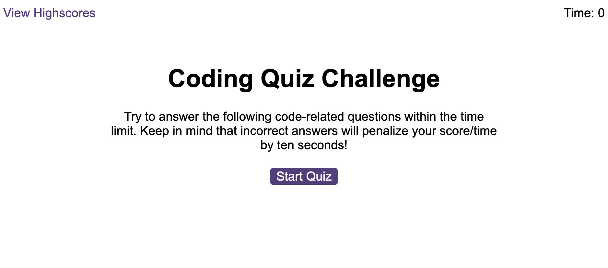
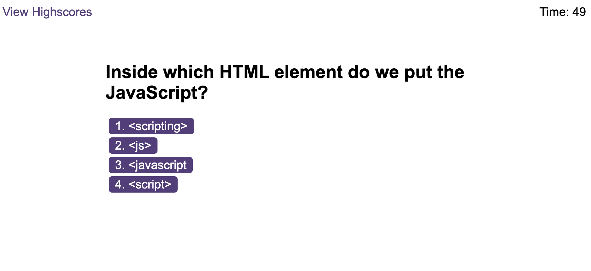
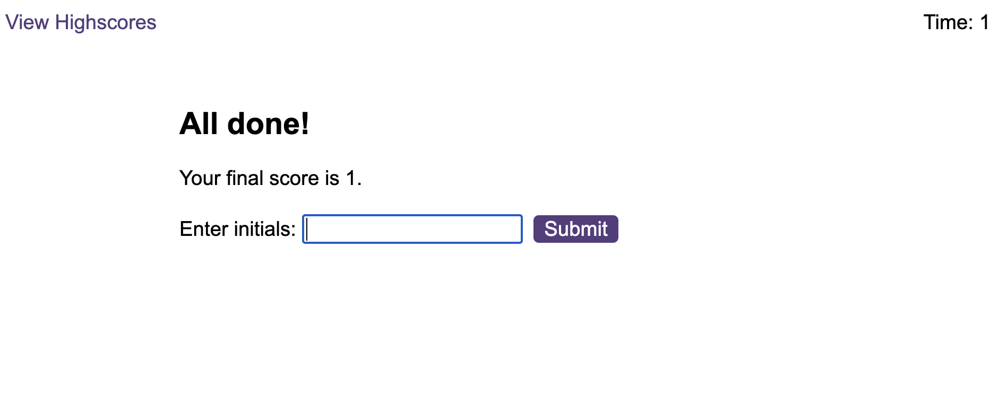

# javascript-quiz

## Description 

Alongside HTML and CSS starter code provided, I have written JavaScript code to build a timed coding quiz with multiple-choice questions. This app will run in the browser, features dynamically updated HTML and CSS provided in the starter code, powered by JavaScript code I've written. It has a clean, polished, and responsive user interface.

User story:
AS A coding boot camp student
I WANT to take a timed quiz on JavaScript fundamentals that stores high scores
SO THAT I can gauge my progress compared to my peers

My motivation behind this was to advance my learning and showcase my skills using JavaScript.

## Screenshots

## Link
https://sophiedodsworth.github.io/javascript-quiz/

## License 
MIT license